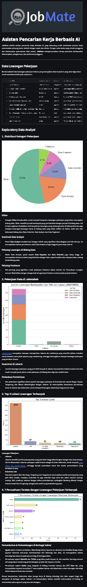

# 👔 JobMate - Your Career Management Solution

Welcome to **JobMate** – a job application tracker and career management platform that helps job seekers stay organized, monitor their applications, and gain insights into their job search progress. 🚀

---

## 📌 Table of Contents
- [Overview](#overview)
- [Features](#features)
- [Demo](#demo)
- [Contributing](#contributing)
- [Contact](#contact)

---

## 📖 Overview
JobMate is designed to streamline job tracking with a user-friendly interface and insightful analytics. Whether you're actively applying for jobs or passively tracking career opportunities, JobMate provides an **all-in-one** solution to **boost productivity** and **stay organized** in your job search.

---

## ✨ Features
✅ **Job Application Tracking** – Keep a structured log of job applications, statuses, and outcomes.  
✅ **AI-Powered Job Recommendations** – Receive insights on jobs that align with your skills.  
✅ **Interview Scheduler** – Plan and set reminders for upcoming interviews.  
✅ **Resume & Cover Letter Manager** – Store and manage important job documents.  
✅ **Analytics Dashboard** – Visualize job application success rates with interactive charts.  
✅ **Company Research Notes** – Save key information on companies for future reference.  

---

## 🎥 Deployment
📌 **EDA**:   
📽️ **Chatbot**: 

---

## 🛠️ Tech Stack
    

---

## 🖥️ Usage
1. **Sign Up/Login** – Register using email or Google authentication.
2. **Add Job Applications** – Enter job details such as company, role, and application status.
3. **Monitor Progress** – Track interview stages and update statuses.
4. **Analyze Job Trends** – View success rate insights and application stats.
5. **Manage Documents** – Store and retrieve resumes, cover letters, and notes.

---

## 🤝 Contributing
We welcome contributions! Follow these steps to contribute:
1. Fork the repository.
2. Create a new branch (`git checkout -b feature-branch`).
3. Commit changes (`git commit -m "Added new feature"`).
4. Push to your branch (`git push origin feature-branch`).
5. Open a Pull Request.

---

## 📧 Contact
Developed by **[Yohanes Raditya Wirawan Aruan](https://github.com/radityaaruan)**  
📩 Email: `radityaruan@gmail.com`  
🔗 LinkedIn: [Your LinkedIn Profile]([https://www.linkedin.com/in/yourprofile](https://www.linkedin.com/in/yohanes-raditya-wirawan-aruan/))

---

🚀 **Stay Organized, Stay Hired with JobMate!**

