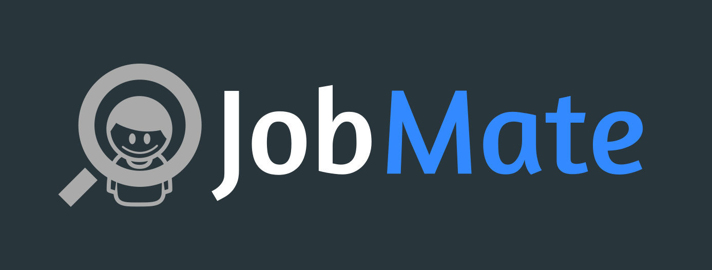
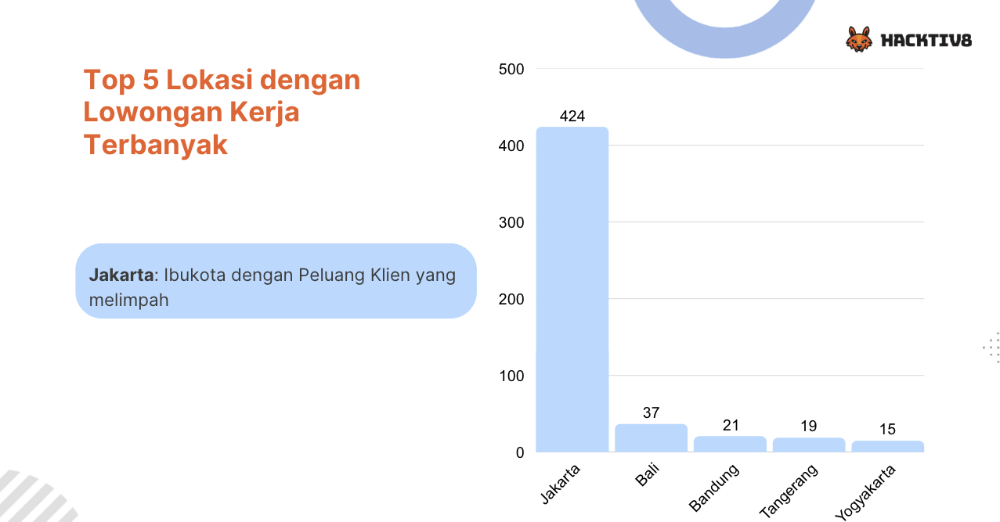

# 👔 JobMate - Pencarian karir anda

Selamat datang di **JobMate** – platform pelacak lamaran kerja dan manajemen karier yang membantu pencari kerja tetap terorganisir, memantau lamaran mereka, serta mendapatkan wawasan mengenai kemajuan pencarian kerja. 🚀

## 📖 Overview
JobMate dirancang untuk menyederhanakan pelacakan pekerjaan dengan antarmuka yang ramah pengguna dan analitik yang informatif. Baik Anda sedang aktif melamar pekerjaan atau sekadar memantau peluang karier, JobMate menyediakan solusi **all-in-one** untuk **meningkatkan produktivitas** dan **tetap terorganisir** dalam pencarian kerja.

---

## ✨ Flowchart
 

---

## 🎥 Deployment
📌 **EDA**: 
 
 
 

📽️ **Chatbot**: 

---

## 🛠️ Tech Stack
    

## 📧 Contact
Developed by 
**[Yohanes Raditya Wirawan Aruan](https://github.com/radityaaruan)**,
**[Ferryansa](https://github.com/ferryansa)**,
**[Fadhiil](https://github.com/FadhiilDzaki)**,
**[Ruach](https://github.com/rsakadewa7)**, and
**[Zahara](https://github.com/ZaharaJannah)**

📩 Email: `radityaruan@gmail.com`  

🔗 LinkedIn: [Yohanes Raditya Wirawan Aruan](https://www.linkedin.com/in/yohanes-raditya-wirawan-aruan/) 
---

🚀 **Stay Organized, Stay Hired with JobMate!**

