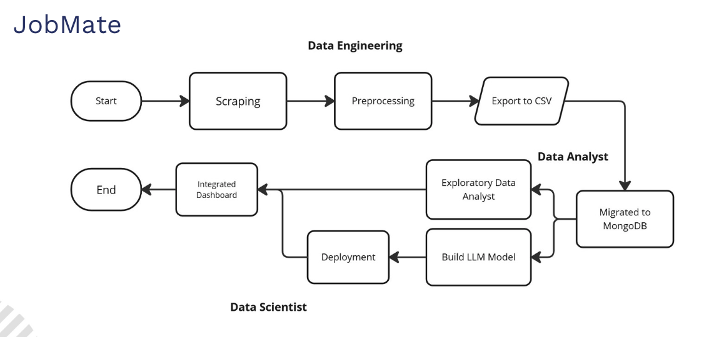
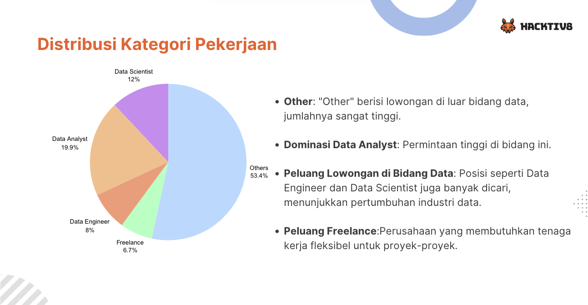
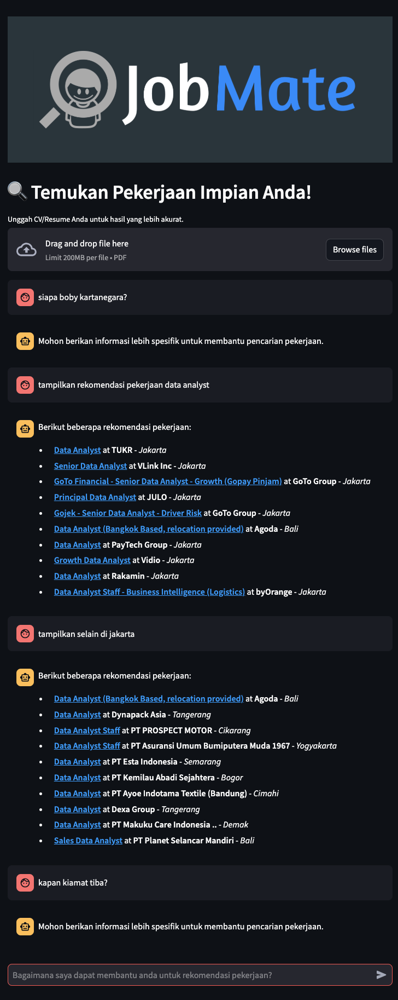

# 👔 JobMate - Your Career Management Solution

Welcome to **JobMate** – a job application tracker and career management platform that helps job seekers stay organized, monitor their applications, and gain insights into their job search progress. 🚀

## 📖 Overview
JobMate is designed to streamline job tracking with a user-friendly interface and insightful analytics. Whether you're actively applying for jobs or passively tracking career opportunities, JobMate provides an **all-in-one** solution to **boost productivity** and **stay organized** in your job search.

---

## ✨ Flowchart
 

---

## 🎥 Deployment
📌 **EDA**: 
 
 
 

📽️ **Chatbot**: 
[

---

## 🛠️ Tech Stack
    

## 📧 Contact
Developed by **[Yohanes Raditya Wirawan Aruan](https://github.com/radityaaruan)**  
📩 Email: `radityaruan@gmail.com`  
🔗 LinkedIn: [Your LinkedIn Profile]([https://www.linkedin.com/in/yourprofile](https://www.linkedin.com/in/yohanes-raditya-wirawan-aruan/))

---

🚀 **Stay Organized, Stay Hired with JobMate!**

